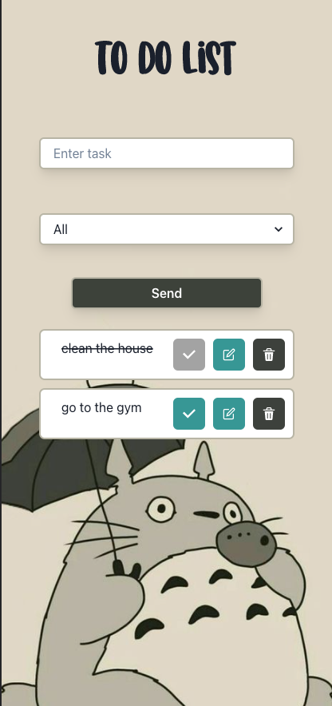
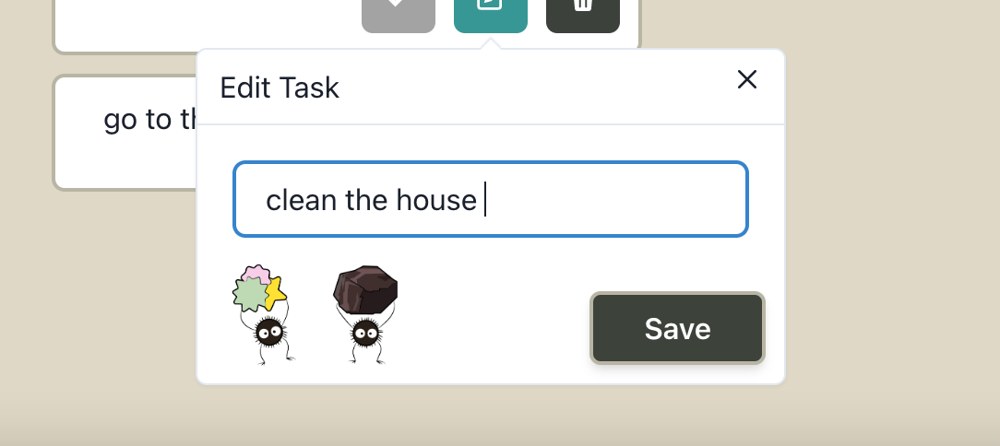
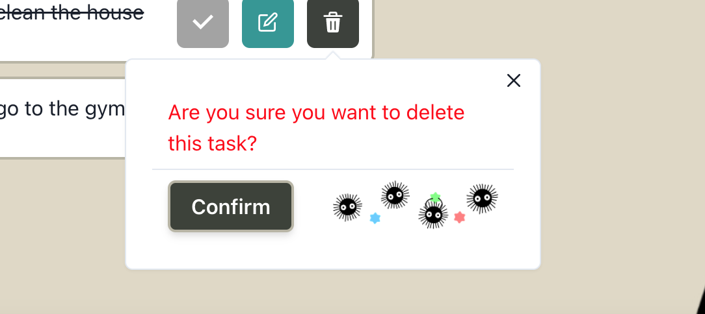
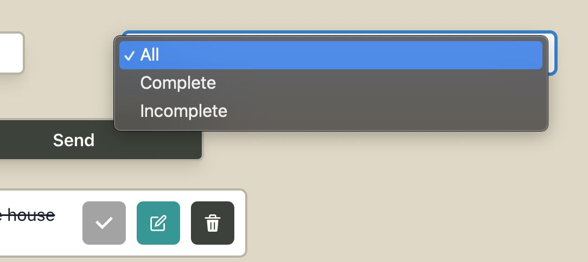

# To Do List
----
by **Solange Aimery** 🖤

you can see my app by clicking [here](https://todolist-solaimery.vercel.app/) 👈

## In this web application you can manage your pending tasks...

It is 100% responsive, works on desktop tablet and mobile.

### Mobile 

You can edit your tasks and delete them.

    

You can also check the tasks carried out and filter them

All the data is saved in localStorage to be able to give it the continuous and practical use of the user... 

## 🛠️ Build entirely with:
- React with [Vite](https://vitejs.dev/guide/)
- [Chakra](https://chakra-ui.com/)

## Thank you for reading 🖤
